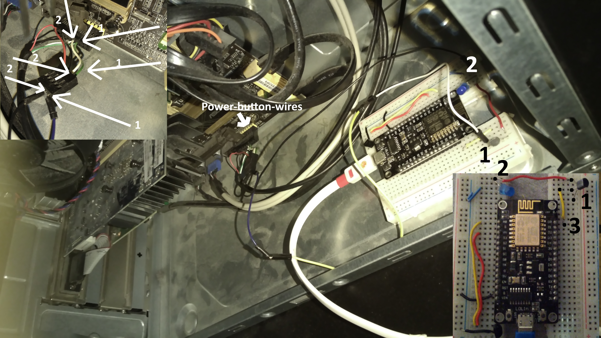
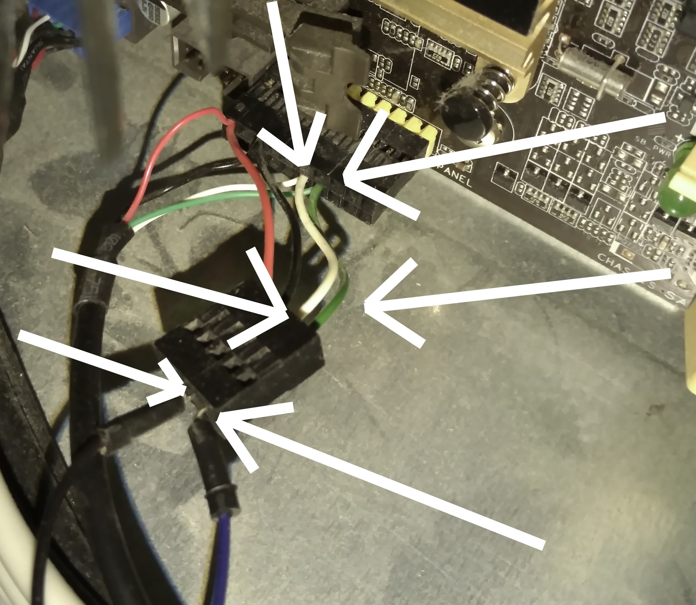
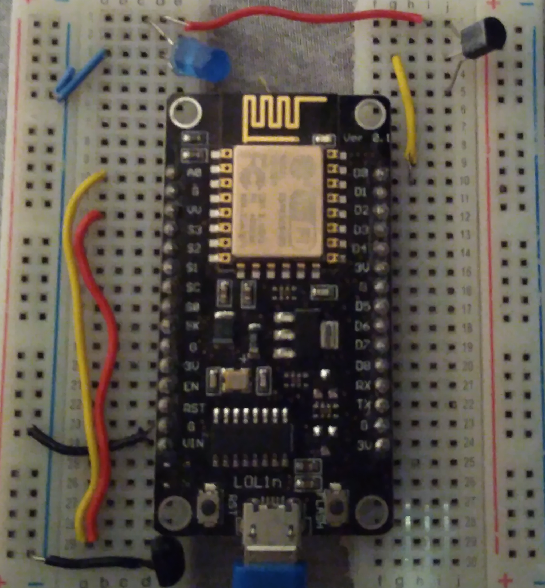

# Remote-PC-button
Remotely switching the PC on and off
The physical PC-button is wired to an ESP NodeMCU-board to be controlled remotely. The NodeMCU is set up as a web server. Through http-commands the PC can get switched on or off or even get the temperature from the air inside the PC-box.

1. Start with finding the two wires behind the PC-button. A quick connection between these two wires leads to a switch on. A connection for at least 8-seconds-long-period leads to a reset. 
2. Get the NodeMCU-board in place with a transistor and wire the button wires(1 & 2) to the transistor. the transistor is further wired up to an OUT-pin(3) at the NodeMCU. 

From wire(2) at the NodeMCU a light is connected in one end and another end it is grounded to create a circuit through. 

